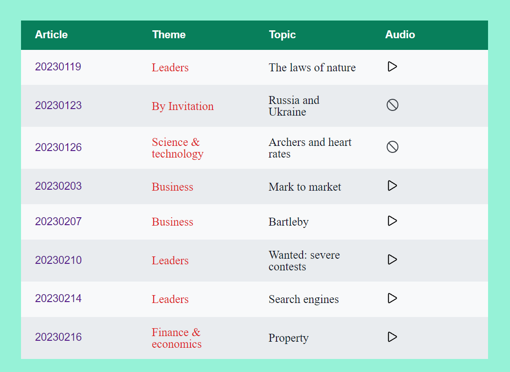

# The Economist Sharing Project

English ｜ [中文(简体)](README-CN.md)

## Background

The idea of this repo is from my long-standing reading habits of <a href="https://www.economist.com/" target="_blank">The Economist </a>articles, and the reason why I Initiate this project, on the one hand, I want to archive every article I read, on the other hand, it will push me to continue reading magazines

## Website

- I build a website using Github pages for this project, You could view <a href="https://ascendho.github.io/The-Economist-Sharing/src/entry/entry.html" target="_blank">here</a>

- Preview:

  

## Folder clarification

**articles**: including pdf version article with Chinese translation

**audios**: including corresponding audio

(**Note**: files are named by date, for example, 20230119.pdf means I read this article on 19 January, 2023)

## Article theme

Mostly, I select articles within the theme of **Science & technology**、**Business**、**Culture** and **Economy**

## Update

Normally, I read 1 article every 2 days, it means that I update this project every 2 days

## LICENSE

Before you participate in this project, You should follow these rules:

- The source code of this repo is under <a href="https://github.com/ascendho/The-Economist-Sharing/blob/master/LICENSE">MIT LICENSE</a>
- For any materials involved in this repo, if you feel you have been infringed, please just [email](mailto:ascendho@outlook.com) me
- The articles and audios are just for self-reading and learning, commercial activities are **forbidden**

## Acknowledgements

The font-family、color、icons、images of this project are from:

- <a href="https://www.google.com/fonts">Google Fonts</a>

- <a href="https://yeun.github.io/open-color/">Open Color</a>、<a href="https://tailwindcss.com/">tailwindcss</a>
- <a href="https://ionic.io/ionicons">Ionicons</a>、<a href="https://heroicons.com/">Hero Icons</a>、<a href="https://www.iconfinder.com/">iconfinder</a>
- <a href="https://unsplash.com/">Unsplash</a>、<a href="https://www.pexels.com/">Pexels</a>
